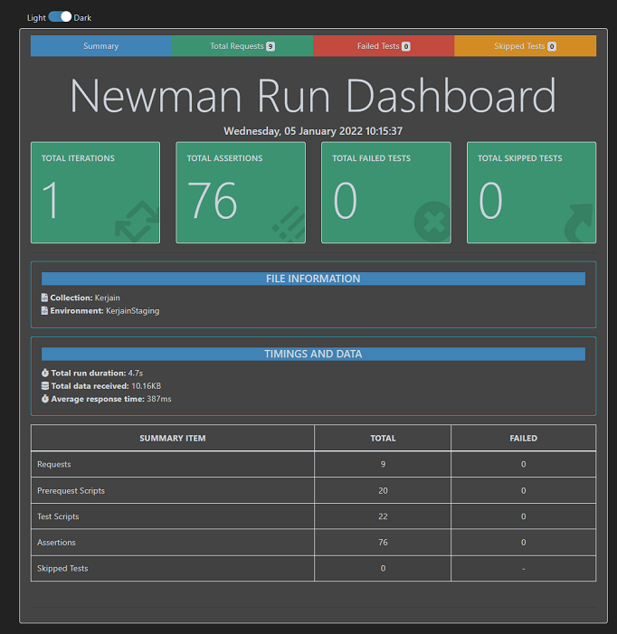

# How to run postman collection in command-line interface

To be able to run Postman collection in command-line interface, you must have Newman installed.
The easiest way to install Newman is using NPM. If you have Node.js installed, it is most likely that you have NPM installed as well.

1. **Install newman**  
`$ npm install -g newman` This installs Newman globally on your system allowing you to run it from anywhere. If you want to install it locally, Just remove the `-g` flag.

2. **Generating reports**  
To be able to retrieve a beautiful reporting for debugging purpose after running your Postman collection in command-line interface, you need `newman-reporter-htmlextra` plugin installed.
To globally install the htmlextra package: `$ npm install -g newman-reporter-htmlextra`
To use htmlextra as a library, install the package as a dependency into a nodejs project's `package.json` file using: `$ npm install -S newman-reporter-htmlextra`

3. **Install newman and htmlextra at once**  
To install `node`, `newman` and the `htmlextra` packages together, use this command to pull the Docker image: `$ docker pull dannydainton/htmlextra`

4. **Command to run newman and generating reports**  
In order to enable this reporter, specify `htmlextra` in Newman's `-r` or `--reporters` option.
The following command will run `Kerjain.postman_collection.json` with `KerjainStaging.postman_environment.json` as the environment variables, and create a new report in the `./newman` directory, if the directory does not exist, it will be created as part of the `Newman run Kerjain.postman_collection.json -e KerjainStaging.postman_environment.json -r htmlextra`

# Run collection in postman.

This collection can be run directly in postman, to run collectoin directly in Postman :

1. Download postman : https://www.postman.com/downloads/.
2. Import JSON postman_collection and environment.
3. Click collection runner.
4. Choose environment.
5. Click `Start Run`
6. Wait until process running done.

# HTML extra report preview

